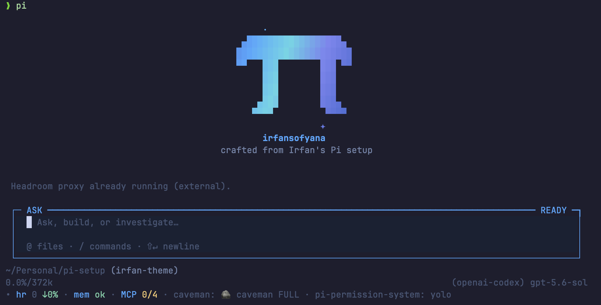
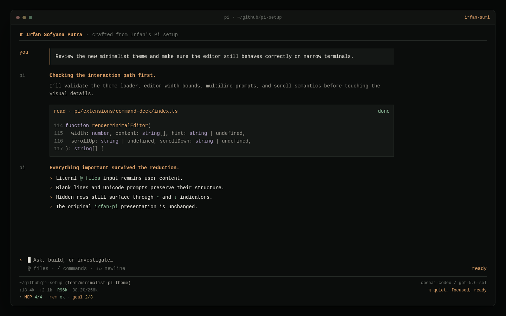

# My Pi Setup

Personal Pi coding-agent setup: theme, extensions, MCP, memory, context compression, subagents, skills, and operational guardrails.



## What this repository provides

| Area | Included |
| --- | --- |
| Core agent | Pi coding agent with LLM provider login via `/login` |
| Theme/UI | `irfan-pi` and minimalist `irfan-sumi` themes, `command-deck` chat editor, and `pi-signature.ts` header/footer extension |
| MCP | MCP adapter plus Tavily, Exa, Brave Search, OAuth, and bearer patterns |
| Delegation | Trusted global researcher, code-mapper, worktree builder, reviewer, and structured user questions |
| Guardrails | Permission gates, todos, persisted goals, and local Cursor-style prompt loops |
| Context | `context-mode` and local Headroom compression/retrieval |
| Memory | Local Hindsight adapter and generated managed skills |
| Side questions | Local `/btw` channel for context-aware questions while main agent works |
| Routing | `pi-9router-ext` model/search routing tools |
| Operations | Markdown preview, usage stats, and Caveman response mode |
| Skills | Research, review, diagrams, frontend, sparring, docs, and Notion workflows |
| Optional tools | Understand-Anything code graphs and Notion `ntn` CLI |

### `irfan-sumi` preview



`irfan-sumi` keeps the full Pi workflow while reducing the header and chat input to warm, quiet essentials. Existing `irfan-pi` users can follow the [switch and rollback guide](docs/setup/configuration.md#switch-from-irfan-pi-to-irfan-sumi).

## Repository layout

```text
pi/
  agents/                     # trusted global subagent templates + defaults
  themes/
    irfan-pi.json            # main theme
    irfan-sumi.json          # minimalist ink-and-amber alternate
    irfan-gruvbox.json       # alternate Gruvbox theme
    gruvbox-dark.json        # alternate/base theme
  extensions/
    pi-signature.ts          # signature header + compact footer
    command-deck/            # custom chat input/editor template
    headroom/                # local Headroom adapter template
    hindsight/               # local Hindsight adapter template
    managed-skills/          # local managed generated skills template
    goal-loop/               # local /goal extension template
    loop/                    # local Cursor-style /loop extension template
    btw/                     # local /btw side-question extension template
    caveman/                 # local /caveman extension template
docs/setup/                  # detailed setup and operations guides
skills/pi-setup/             # approval-gated setup/audit skill
```

Do **not** copy entire `pi/` folder into `~/.pi/`. Copy only needed files/templates.

## Fresh-machine bootstrap

Recommended path: install Pi and this repository's setup skill first. Skill audits existing state, proposes exact changes, and waits for approval before mutating machine.

Prerequisites: Node.js/npm on `PATH`, `pipx` or `uv`, Git, and provider credentials supplied through `/login` or environment variables.

```bash
# 1) Install Pi
curl -fsSL https://pi.dev/install.sh | sh
# or
npm install -g @earendil-works/pi-coding-agent

# 2) Clone setup repository and enter its root
git clone https://github.com/irfansofyana/pi-setup.git
cd pi-setup

# 3) Install setup skill
npx skills add . --global --skill pi-setup

# 4) Start Pi from this repository
pi
```

Inside Pi, authenticate if needed, then invoke skill:

```text
/login
Audit this Pi setup and propose changes; do not mutate until I approve.
```

Skill reads canonical manifest below and relevant topic guides. Manual setup remains available through [Installation](docs/setup/installation.md).

## Required npm package manifest

These nine commands are canonical. Keep package names and install forms exact.

```bash
pi install npm:pi-mcp-adapter
pi install npm:@tintinweb/pi-subagents
pi install npm:@gotgenes/pi-permission-system
pi install npm:context-mode
pi install npm:@juicesharp/rpiv-ask-user-question
pi install npm:pi-markdown-preview
pi install npm:@juicesharp/rpiv-todo
pi install npm:pi-9router-ext
pi install npm:pi-stats-ext
```

| Package | Purpose |
| --- | --- |
| `pi-mcp-adapter` | Standard MCP config and tools |
| `@tintinweb/pi-subagents` | Delegated agent workflows |
| `@gotgenes/pi-permission-system` | Approval gates |
| `context-mode` | Context-saving tools and workflows |
| `@juicesharp/rpiv-ask-user-question` | Structured questions |
| `pi-markdown-preview` | Markdown render/export |
| `@juicesharp/rpiv-todo` | Task tracking |
| `pi-9router-ext` | Model/search routing |
| `pi-stats-ext` | Usage statistics |

Run `/reload` after package installation. Use `pi list` to inspect installed package sources.

## Configuration scope summary

| Path | Scope | Purpose |
| --- | --- | --- |
| `~/.pi/agent/settings.json` | Global Pi | Theme and Pi settings |
| `~/.pi/agent/themes/` | Global Pi | Themes |
| `~/.pi/agent/extensions/` | Global Pi | Extensions, including Command Deck chat editor |
| `~/.pi/agent/agents/` | Global Pi | Trusted reusable subagent roles |
| `~/.pi/agent/subagents.json` | Global Pi | Subagent concurrency, UI, model-scope, and transcript defaults |
| `~/.pi/agent/extensions/pi-permission-system/config.json` | Global Pi | Permission policy |
| `~/.pi/agent/headroom/config.json` | Global Pi | Headroom adapter |
| `~/.pi/agent/hindsight/config.json` | Global Pi | Hindsight daemon |
| `~/.pi/agent/managed-skills/` | Global Pi | Generated skills |
| `~/.pi/agent/btw/config.json` | Global Pi | BTW side-question config |
| `~/.pi/agent/goal-loop/` | Global Pi | Goal config, state, archive, logs |
| `~/.config/mcp/mcp.json` | Global shared | Preferred shared MCP config |
| `~/.pi/agent/mcp.json` | Global Pi | Pi-specific MCP override |
| `.mcp.json` | Project-local | Project MCP servers |

Global files affect every Pi project. Project-local `.mcp.json` belongs at project root and should contain only project-specific servers. Never commit credentials; use `/login`, environment variables, or referenced provider profiles.

Full paths and configuration examples: [Configuration](docs/setup/configuration.md).

## Topic guides

| Guide | Contents |
| --- | --- |
| [Installation](docs/setup/installation.md) | Prerequisites, Pi install, package-manifest usage, local template copy |
| [Configuration](docs/setup/configuration.md) | Paths, scope, auth, theme, signature UI |
| [MCP](docs/setup/mcp.md) | Global/project config, search servers, OAuth, bearer auth, commands |
| [Permissions](docs/setup/permissions.md) | Global approval policy and migration notes |
| [Subagent team](docs/setup/subagents.md) | Researcher, code mapper, worktree builder, reviewer, orchestration, and trust boundary |
| [Local extensions](docs/setup/local-extensions.md) | Command Deck chat editor, Headroom, Hindsight, managed skills, BTW, Caveman, goal loop, prompt loop |
| [Using Hindsight day to day](docs/setup/hindsight-daily-use.md) | Scope choices, trigger prompts, tool payloads, memory hygiene, and a practical workflow |
| [Skills and tools](docs/setup/skills-and-tools.md) | `npx skills`, Understand-Anything, Notion CLI |
| [Operations](docs/setup/operations.md) | Daily commands, verification, troubleshooting, maintenance |

## Setup skill safety model

- Audit is read-only and classifies each item before proposing changes.
- Every mutation needs explicit proposal-number approval.
- Existing files receive private backups and rollback steps before replacement.
- Credentials stay in `/login`, environment variables, or provider profiles.

## Core operating rules

- Install npm Pi packages only with `pi install npm:<package>` commands from canonical manifest.
- Install GitHub Pi packages with `pi install git:github.com/<owner>/<repo>` when explicitly documented.
- Install skills with `npx skills` or `npx skills@latest`; do not manually copy skill files.
- Copy reviewed reusable agent templates to `~/.pi/agent/agents/`; never trust project-defined agents from an untrusted repository.
- Copy repo-owned local extension templates from `pi/extensions/`.
- Preserve unknown keys when editing existing JSON/JSONC configuration.
- Back up config before mutation and stop if installed state differs unexpectedly.
- Keep credentials in `/login`, environment variables, or provider profile config—not this repository.
- Run `/reload` after changing extensions, themes, MCP, permissions, skills, or related config.

## Minimal verification

From shell:

```bash
pi --version
pi list
```

Inside Pi:

```text
/reload
/mcp
/mcp tools
/settings
```

Check expected startup extensions/skills, select `irfan-pi` or optional `irfan-sumi`, and inspect permission prompts before mutating files. For component checks and troubleshooting, use [Operations](docs/setup/operations.md).

## Updating setup

```bash
pi update
pi update --extensions
pi list
```

After any extension/config change, run `/reload` or restart Pi. Repository changes alone do not update files already copied under `~/.pi/agent/`.
